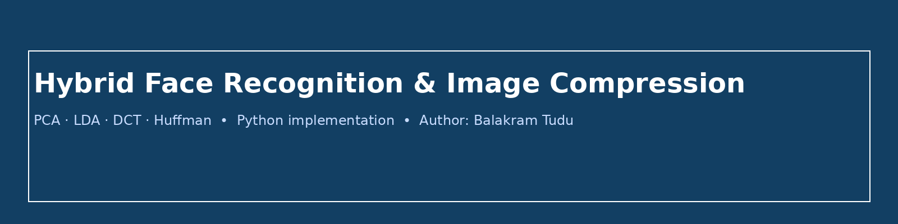

# Hybrid Face Recognition & Image Compression System

**Author:** Balakram Tudu



## Overview
This repository implements a hybrid system that performs face recognition using PCA (Eigenfaces) + LDA (Fisherfaces) and image compression using DCT + Huffman coding. The code is modular, well-documented, and meant for educational/demo purposes.

## Features
- PCA-based eigenface extraction
- LDA-based discriminant features (Fisherfaces)
- DCT (8x8) based image compression with quantization and Huffman coding
- Evaluation metrics: PSNR, MSE, Compression Ratio
- Jupyter notebooks for experiments and demos

## Repo Structure
```
FaceRec_Compression_Repo/
├─ assets/
│  └─ banner.png
├─ src/
│  ├─ __init__.py
│  ├─ main.py
│  ├─ pca_eigenfaces.py
│  ├─ lda_fisherfaces.py
│  ├─ compression.py
│  └─ utils.py
├─ notebooks/
│  └─ demo.ipynb
├─ docs/
│  └─ report.pdf
├─ tests/
│  └─ test_pipeline.py
├─ requirements.txt
├─ README.md
└─ LICENSE
```

## Quickstart
1. Create a virtual environment and install dependencies:
```bash
python3 -m venv venv
source venv/bin/activate
pip install -r requirements.txt
```

2. Run the demo (replace paths as needed):
```bash
## 🎬 Demo
[](https://github.com/balakram/hybrid-face-recognition-compression)

```

## Contributing
Contributions are welcome — please open issues or pull requests.

## License
This project is licensed under the MIT License. See `LICENSE` for details.
